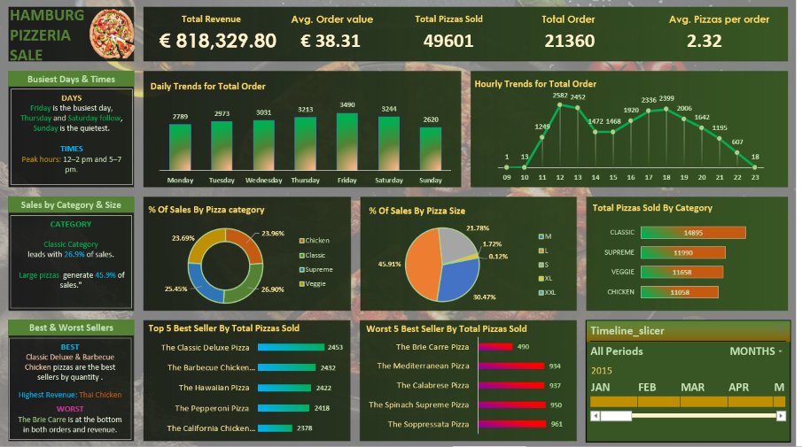

<h1 align="center">🍕 Hamburg Pizzeria Sales Analysis</h1>

<p align="center">
  <b>From raw sales data to business decisions with SQL and Excel</b><br>
  
  
  
  
</p>

<p align="center">
  
</p>

---

## 🎯 What is this project about?

This project analyses one year of pizza sales data to answer the questions a pizzeria owner would ask.
I loaded the data into **PostgreSQL**, checked its quality, answered 15 business questions with SQL, and built an **interactive Excel dashboard** to present the results.

## 📈 Results at a glance

| 💶 Revenue | 🧾 Orders | 🍕 Pizzas sold | 🛒 Avg. order value | 📦 Pizzas per order |
|:---:|:---:|:---:|:---:|:---:|
| **€ 818,329.80** | **21,360** | **49,601** | **€ 38.31** | **2.32** |

## 🔍 What I found

| Question | Answer |
|---|---|
| Which day is the busiest? | **Friday** (3,490 orders). Sunday is the quietest (2,620). |
| When do customers order? | Two peaks: **12:00–14:00** and **17:00–19:00**. |
| Which category earns the most? | **Classic** – 26.9 % of revenue. |
| Which size sells best? | **Large** – 45.9 % of revenue. XL and XXL together are under 2 %. |
| Best pizza by revenue? | **The Thai Chicken Pizza** (€ 43,434.25). |
| Weakest pizza? | **The Brie Carre Pizza** – lowest in quantity (490) and revenue. |

## 💡 Business recommendations

1. **Plan staff around the peaks** – Friday and the lunch/dinner hours need the most people.
2. **Boost Sundays** with an offer, because it is the weakest day.
3. **Review XL and XXL sizes** – they sell very little and may not be worth the effort.
4. **Review the Brie Carre pizza** – improve it, promote it, or replace it.

## 🧪 A taste of the SQL

```sql
-- Revenue and share of total sales by pizza category
SELECT pizza_category,
       ROUND(SUM(total_price)::NUMERIC, 2) AS total_revenue,
       ROUND((SUM(total_price) / (SELECT SUM(total_price) FROM hamburg_pizzeria_sales) * 100)::NUMERIC, 2) AS pct_contribution
FROM hamburg_pizzeria_sales
GROUP BY pizza_category
ORDER BY pct_contribution DESC;
```

## ✅ Data quality first

Before any analysis I checked: missing values, orders with conflicting dates or times, weekday vs. date, and `unit_price × quantity = total_price`. **All checks passed.**

## 📁 Project structure

```
hamburg-pizzeria-sales-analysis/
├── data/                              → raw CSV file
├── excel/                             → interactive dashboard (.xlsx)
├── screenshots/                       → dashboard preview images
├── sql/
│   ├── 00_create_table.sql            → create table + load CSV
│   ├── 01_data_quality_checks.sql     → data validation
│   └── 02_business_queries.sql        → 15 queries behind the dashboard
└── README.md
```

## ▶️ How to run

1. Create a PostgreSQL database and run `sql/00_create_table.sql`.
2. Load `data/hamburg_pizzeria_sales.csv` (command is inside the file).
3. Run `sql/01_data_quality_checks.sql`, then `sql/02_business_queries.sql`.
4. Open `excel/Hamburg_Pizza_Sales_Dashboard.xlsx` and explore the dashboard.

## 🧰 Skills shown

`SQL aggregation` · `GROUP BY / subqueries` · `date & time functions` · `data validation` · `KPI design` · `Excel dashboard & slicer` · `business storytelling`

## ℹ️ About the data & what I added

**Data source:** the dataset is a practice dataset, shared publicly for learning SQL and Excel: [Pizza Data For SQL & Excel (Google Drive)](https://drive.google.com/drive/folders/1ecpBALfFUMSK-GOnk-X4nZhC_uK18zih). I found it through the YouTube tutorial *"SQL & Excel Portfolio Project "* by *[SWAPANJEET S]* . The data is used here for learning and portfolio purposes only.

**What I added myself:**
- ✅ **Data quality checks** in SQL (missing values, conflicting dates, price and weekday validation) before any analysis
- ✅ **15 documented SQL queries**, each with its expected result, and **all numbers cross-checked** between SQL and the Excel dashboard
- ✅ **Interactive Excel dashboard** with KPIs, trends, category and size analysis, and a time slicer
- ✅ **Business recommendations** based on the findings
- ✅ **Clean project structure and documentation**, so anyone can reproduce the results step by step


## 👤 Author

**[DOLLY]** · [LinkedIn] · [dollykhanna3210@gmail.com]
